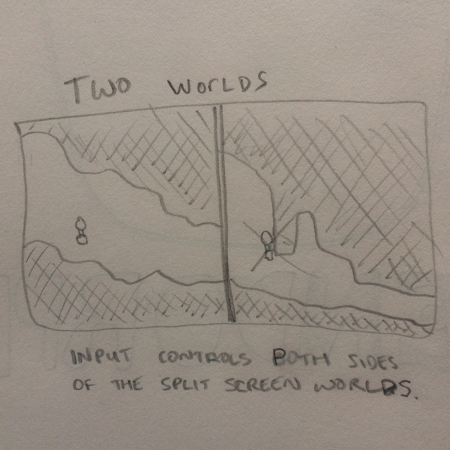
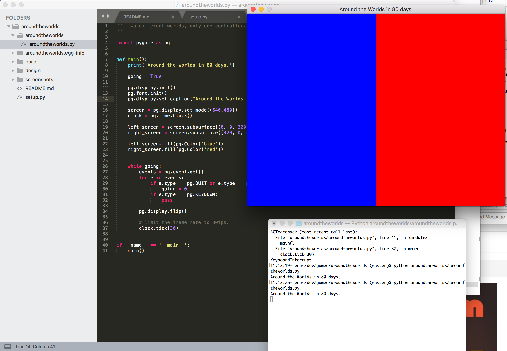
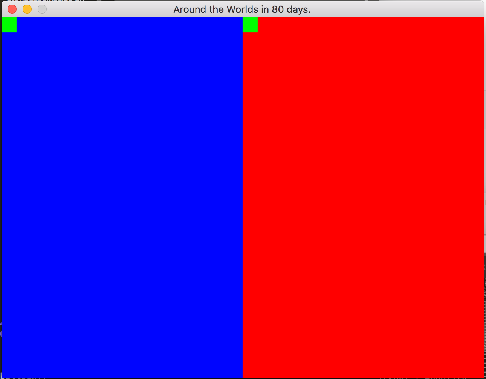
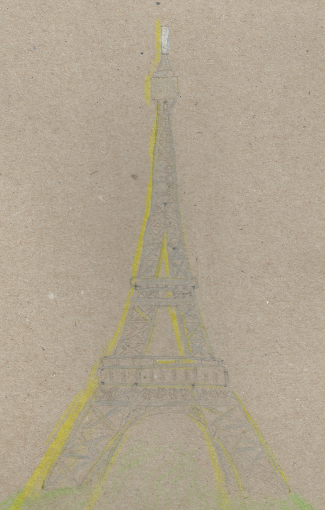
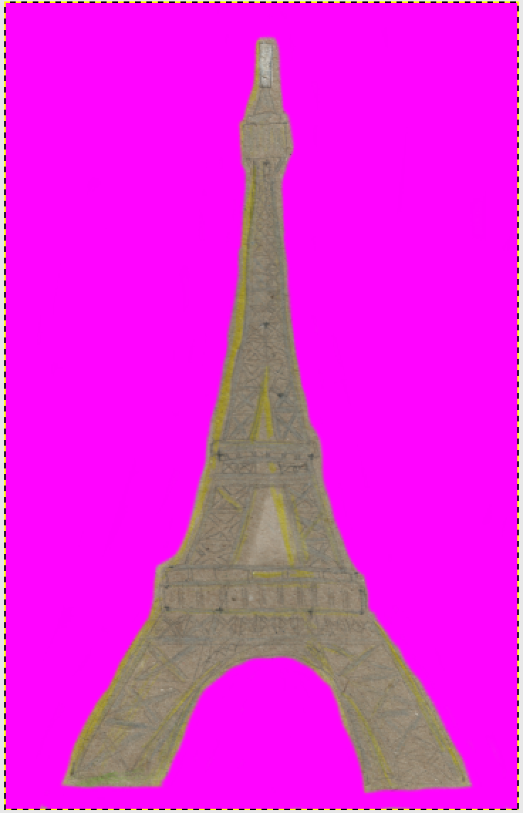
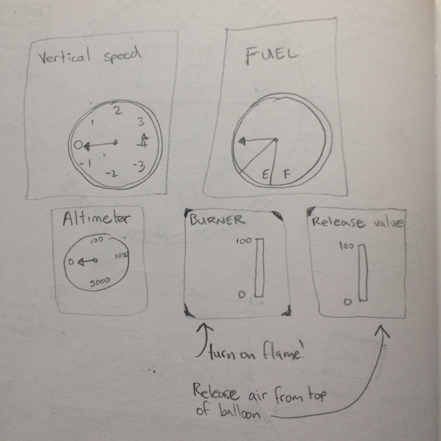
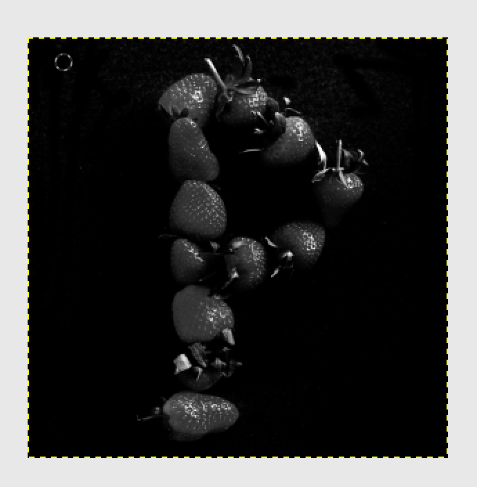

Around the Worlds in 80 days.

python aroundtheworlds/aroundtheworlds.py

## Log.

### Sun 15 Apr 2018 09:25:52 CEST

For my Two Worlds pyweek... I'm thinking of doing a split screen game. Where you control the avatar in both worlds. So your input has to avoid collisions in both. Controlling the hot air that goes into a balloon to make it rise. Just obstacle avoidance I guess, but sort of interesting because you have to do it in two Worlds at once.

I'm using pygame and will also try a bunch of libraries.
[pygame awesome libraries](https://www.reddit.com/r/pygame/comments/89ygm7/pygame_awesome_libraries/)

Probably 'thorpy' for game menus/gui, and 'transitions' for state machines.
  - [thorpy](https://pypi.python.org/pypi/thorpy)
  - [transitions](https://github.com/pytransitions/transitions)

### Sun 15 Apr 2018 09:52:39 CEST

I got the name of the game, and setting up a github repo for it.

Around the Worlds in 80 days.
aroundtheworlds

Jules Verne is awesome. It's one of the first books I read as a child.
[https://en.wikipedia.org/wiki/Around_the_World_in_Eighty_Days](https://en.wikipedia.org/wiki/Around_the_World_in_Eighty_Days)

Also, I remember typing up a balloon game on c64 when I was little too.

So this is a little bit nostalgic for me. But also, I like the setting.

Next up, I'll set up my base code. Probably should have done this earlier.

This is what I hate about python... config file soup.
Note to self: finish pyrelease.

But, I'll at least use pipenv. Warm, happy pipenv.

### Sun 15 Apr 2018 10:33:27 CEST

Adding setup.py and first python file that just print hello.

### Sun 15 Apr 2018 11:14:41 CEST

I have split screens now.

Next up some basic balloons and some terrain.

### Sun 15 Apr 2018 12:00:58 CEST

Because only the Balloon will be moving, we only need to change a small part of the screen
each frame. Luckily pygame handles this nicely.

Efficient screen updates with dirty rects, DirtySprite and LayeredDirty.
When an object

See [Quick & Dirty: Using Pygame's DirtySprite & LayeredDirty (A tutorial)](https://github.com/n0nick/dirty_chimp) for more information about pygame dirty rectangle sprites.

Now I have the basic game objects in place.
Well... they are still 'programmer art'.
The Balloon a green square, and the background just a flat blue or red so far.

The resolution I've decided on is 640x480.

I plan to draw them all by hand at this stage,
and that should make the asset creation easier.

This means 320x480 for each side.

Maybe it would be fun to draw a different city for each 'level'.
So on the left there would be Paris, and on the right London.

And the player has to move both Balloons through the city safely. But they only have one controller for both the Balloons!

### Mon 16 Apr 2018 11:08:12 CEST

I decided to use drawings of monuments in cities to make up the levels.

So here is my drawing of the Eiffel Tower in Paris.

Now I need to cut it out and somehow make a level out of it.
Lots of Eiffel Towers cut and pasted all over to make a level. lol.

But actually, I feel like drawing a hot air balloon.

### Mon 16 Apr 2018 11:36:29 CEST

Cut out the eiffle-tower.png drawing and burned it a little.

### Mon 16 Apr 2018 12:48:32 CEST

Did some research on Balloon valves and such.

ie. I have just been watching you tube videos of how to fly a hot air Balloon.

I feel confident I could go outside right now and fly one! ;)

At some point soon I should probably start writing a simulation of this.
With a unit test to see how all these variables interact.

Some quick sketches of the controls I'll need.

There are two main controls on a hot air Balloon.
You can turn on the burner, and the air will get hot. This makes the Balloon rise.
Then you can pull a cable to let air out of the top of the Balloon, making it drop.

### Thu 19 Apr 2018 00:09:29 CEST

I lost some days to things I had to do in 'life'.

Decided to edit a bunch of letters for my game introduction.

Probably not the wisest idea if I want to finish an actual game...
but oh well. I'm trying to have fun in this pyweek, and do whatever
I feel like.

So now manually touching up the images after they were image processed.

### Thu 19 Apr 2018 02:39:12 CEST

The full size lettering for the intro font. Made of strawberries.

